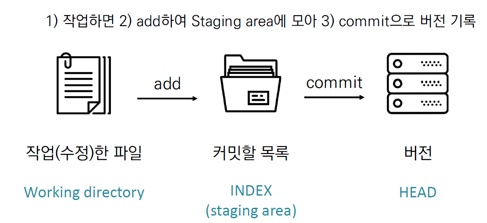
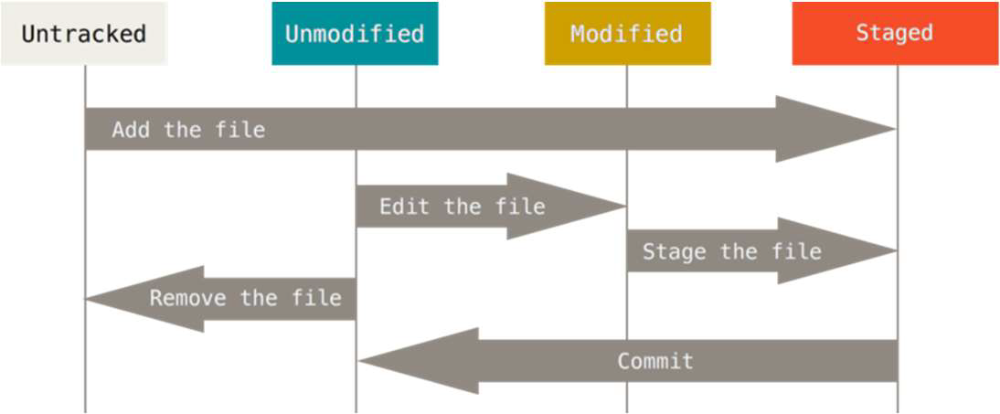
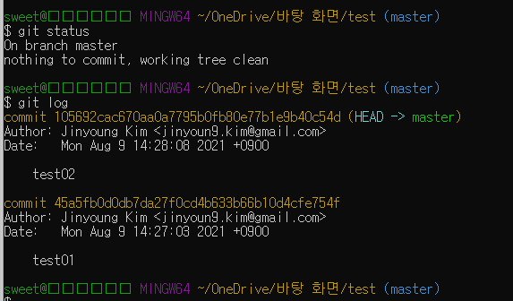

# Github


### CLI (Command Line Interface)

* 가상 터미널 또는 텍스트 터미널을 통해 사용자와 컴퓨터가 상호작용

* 작업 명령은 사용자가 툴바 키보드 등을 통해
* 이 같은 인터페이스를 제공하는 프로그램을 명령 줄 해석기 또는 셸이라고 부른다
* 특정 프로그램을 어떠한 인자와 함께 호출하도록 명령(echo, $PATH:디렉토리목록검색)

### 디렉토리 관리

* pwd (print working directory) : 현재 디렉토리 출력

* cd (change directory) : 디렉토리 이동

* ls (list) : 목록

* mkdir (make directory) : 디렉토리 생성

* touch : 파일의 날짜와 시간을 수정(0바이트 빈파일 생성)


## GIT

* 분산버전관리시스템. 토드의 버전을 관리하는 도구. 컴퓨터 파일의 변경사항을 추적하고 여러 명의 사용자들 간에 해당 파일들의 작업을 조율


* 분산버전관리시스템(DVCS)

중앙집중식버전관리시스템은 중앙에서 버전을 관리하고 파일을 받아서 사용

원격저장소(remote repository)를 통하여 협업하고, 모든 히스토리를 클라이언트들이 공유


### 기본 흐름





#### Git 파일 관리

* modified : 파일이 수정된 상태(add 명령어를 통하여 staging area로)

* staged : 수정된 파일을 곧 커밋할 것이라고 표시한 상태 (commit 명령어로 저장소)

* committed : 커밋이 된 상태


### 파일 라이프사이클

* Working directory의 모든 파일은 특정 상태를 가지며 git 명령어를 통해 변경

* Tacked : 이전부터 버전으로 관리되고 있는 파일

* Unmodified : git status에 나타나지 않음

* Modified : Changed not staged for commit

* Staged : Changed to be commited

* Untracked : 버전으로 관리된 적 없는 파일(파일을 새로 만든 경우)





### 기본 명령어


#### $git inti

* 특정 폴더를 git 저장소를 만들어 git으로 관리. git 폴더가 생성되며, git bash에서는 (master)라는 표기를 확인할 수 있음


#### $git add < file >

* working directory 상의 변경내용을 staging area에 추가하기 위해 사용

* untracked 상태의 파일을 staged로 변경, modified 상태의 파일을 staged로 변경


#### $ git commit -m '커밋메세지'

* staged 상태의 파일들을 커밋을 통해 버전으로 기록

* SHA-1 해시를 사용하여 40자 길이의 체크섬을 생성하고, 이를 통해 고유한 커밋을 표기

* 커밋 메세지는 변경 사항을 나타낼 수 있도록 명확하게 작성해야 함

* git은 데이터를 파일 시스템의 스냅샷으로 관리하고 매우 크기가 작음

* 파일이 달라지지 않으면 서능을 위해 파일을 새로 저장하지 않음

* 기존의 델타 기반 버전 관리시스템과 가장 큰 차이점


#### $git status

* git 저장소에 있는 파일 상태를 확인하기 위하여 활용

* untracked files

* changes not staged for commit

* changes to be committed

* Nothing to commit, working tree clean


#### $ git log

* $git log -1, $git log -online, $git log -2 --online

  

### 실습

* 1. 바탕화면에 test 폴더를 만들고 git 저장소를 만들기

  2. a.txt 파일 넣고 커밋하기

  3.  임의의 파일을 만들고 커밋하기
  4. a.txt 파일 수정하고 커밋하기
     각 단계별로 status 와 log를 보세요.


```bash
echo
mkdir test
touch a.txt
touch b.txt
touch c.txt
git status
git log

cd test
git init
git add *.txt
git status
git los
git commit -m "test01"


# a.txt 수정 후
git add a.txt
git status
git los
git commit -m "test02" 
```





### 실습2

* TIL 포더 만들고 git 저장소 만들기
* README.md 파일 만들고 커밋
* 오늘 작성한 마크다운 파일을 옮기고 커밋 (파일별로 커밋)
* 이제까지 배운 내용들을 정리하고 커밋


```bash
# 폴더 만들고 readme.md파일을 만든다.
git init
git add abc.md
git commit -m "commit내용"

git remote add origin <주소>
git push -u origin <branch name>
```


### README.md 파일

* 각 폴더별로 readme.md 파일을 만들고 각 폴더로의 주소를 링크로 달아준다

